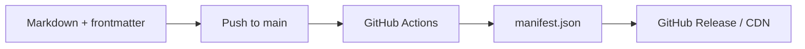
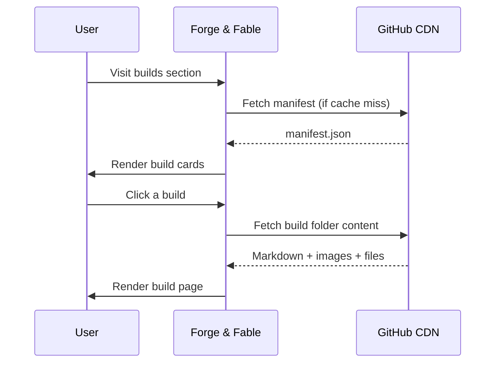

Same structural pattern as the programming CMS, but for physical builds — mostly CAD work and 3D printed things. The metadata reflects that: CAD tools in place of programming languages, links out to Printables or Thingiverse where relevant, and support for downloadable STL and SCAD files alongside the images.

The manifest pipeline is identical. Push, generate, publish, fetch.

**Publishing pipeline — triggered on commit:**

**Site consumption — triggered by the user:**

[View the repository](https://github.com/Broomfields/PS-CMS-Builds)
