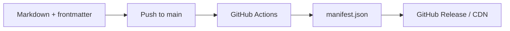
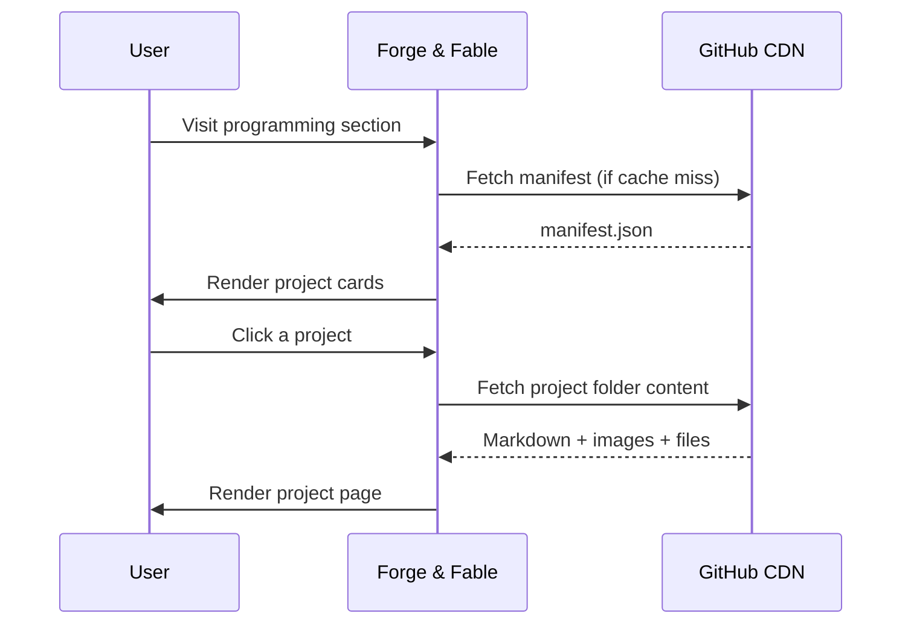

The programming CMS is the most straightforward of the three. Each project gets a folder with a markdown file and an images directory. Frontmatter handles the metadata — title, description, languages, dependencies, status, and so on. A GitHub Actions workflow processes it on push and publishes a manifest to a release tag, which the site fetches at runtime.

That's it. No database, no backend beyond what GitHub provides. Just structured markdown and a CI pipeline.

**Publishing pipeline — triggered on commit:**

**Site consumption — triggered by the user:**

[View the repository](https://github.com/Broomfields/PS-CMS-Programming)
