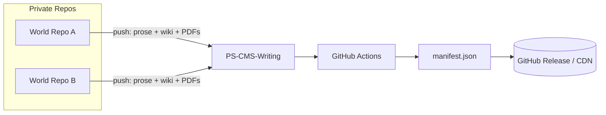
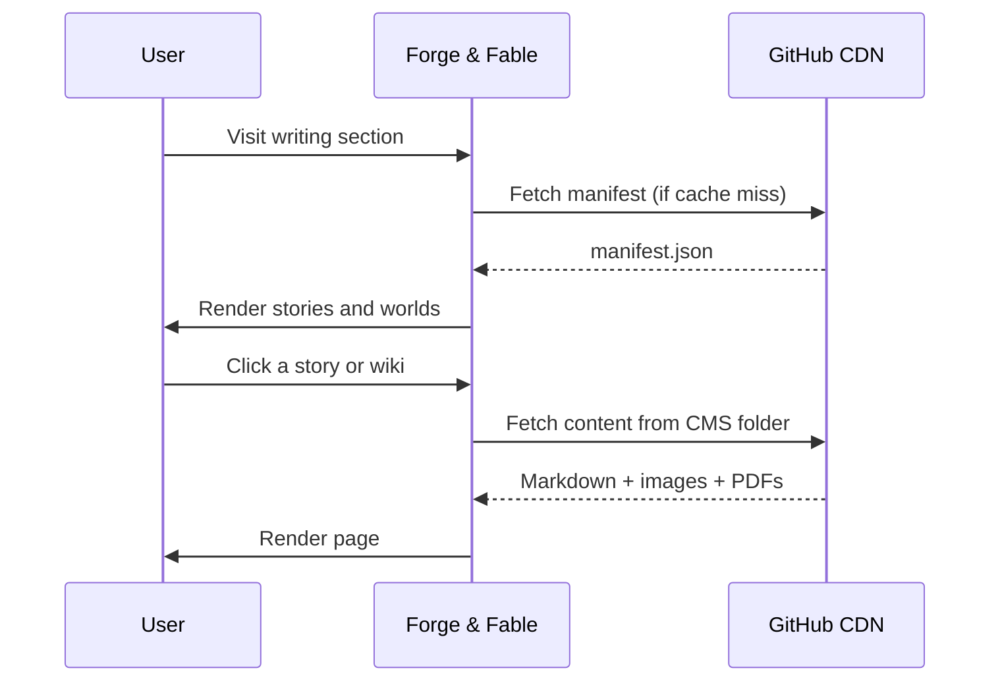

The writing CMS is the most complex of the three, and parts of the architecture are still being solidified. The broad shape is clear, though.

The actual writing lives in private repositories — one per world being built. Those repos are where the work happens: prose drafts, world-building notes, planning documents, all of it. None of that is public-facing. What gets published is curated by the repos themselves.

Each private repo runs GitHub Actions that pull out only what's ready to be seen: tagged prose files, wiki content generated from tagged sections of the world-building notes, and PDF exports of the stories. All of that gets pushed directly into PS-CMS-Writing, overriding whatever was there before. The CMS itself never reaches into the private repos. It just receives what they choose to send.

Once updated, the CMS generates a manifest — pointing to the available stories, which worlds they belong to, and the wikis for those worlds. The PDFs come through the same route, since the source repos are private and can't be linked to directly.

The exact manifest schema for this one is still being designed. It needs to express more than the other two CMSes: world-story relationships, wiki locations per world, prose and PDF availability per story. That's worth getting right rather than rushing.

**Publishing pipeline — triggered on commit to private writing repos:**

**Site consumption — triggered by the user:**

[View the repository](https://github.com/Broomfields/PS-CMS-Writing)
