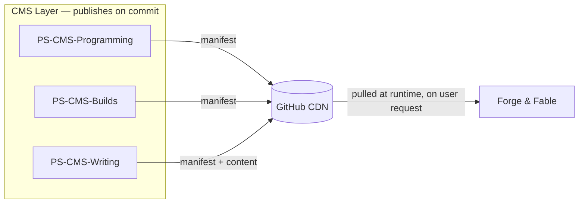

Look, every developer has a personal site. This is mine.

The last one went stale. Not because I stopped doing things worth putting on it — I just stopped wanting to deal with adding them. Updating it was enough of a chore that it wasn't worth the effort, so nothing got added, and eventually it stopped reflecting anything real about what I was actually working on.

This time I wanted to fix that properly. Not just build something nicer to look at, but build something where the content takes care of itself. Work on a project, push it. It should just appear. I shouldn't have to think about the site at all.

Around the same time I was getting properly into GitHub Actions — CI/CD, automated pipelines. And it seemed like exactly the right tool for the problem. The site is built in Blazor Server and pulls live content from three separate headless CMSes: one for programming projects, one for physical builds, one for creative writing. None of them share a database. None of them need to. Each one generates a JSON manifest on push, publishes it to a GitHub release, and the site fetches it over the CDN at runtime. Four repositories, loosely coupled, each doing one thing.

If the design needs a refresh in a few years, the content layer stays untouched. If I want to add a new section, it's a new repo and a new manifest endpoint. It's a bit over-engineered for a personal site — but it's not over-engineered for the problem.

The colour palette came from the writing side of things — volcanic landscapes, dark basalts, muted greens. It felt right to let the creative work bleed into the design a little.

## The CMS layer

Each content area has its own repository and its own manifest pipeline. They share the same structural pattern but are otherwise completely independent.

- [Programming CMS](cms-programming) — programming projects and utilities
- [Builds CMS](cms-builds) — CAD work and physical builds
- [Writing CMS](cms-writing) — creative writing, world-building, and generated artefacts
