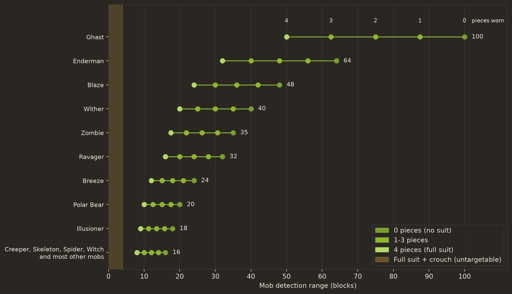

I made this to teach myself how to mod with Fabric. I used the official Fabric example mod as a template and built my own mod on top of it, a mossy ghillie suit that helps you hide from mobs and players. Most of the design work went into the stealth, so this page is about that.

## The set

The suit has four pieces, a hood, tunic, pants, and boots, each made from Moss Weave in the normal armour shapes. Moss Weave is two moss blocks and two string, and the suit repairs with it, so one material carries the loop from making the pieces to keeping them repaired.

## How the stealth works

Stealth comes from the suit in two ways. The first is a gradual reduction in how far mobs can see you, applied per piece, so each piece worn shrinks a mob's targeting range by **12.5 percent**. On the standard **16**-block follow range that is exactly **2 blocks** per piece, and the full suit lands on a clean halving. I chose linear scaling deliberately, since a flat per-piece value is legible and every piece has an effect you can feel.

Because the reduction is a percentage, it applies the same way to mobs with very different detection ranges. The chart below shows that against real mob ranges, with a point for each piece worn.

*Mob detection range by pieces worn. Each mob shows its range with 0 to 4 pieces, halved at the full suit. The band at the left is the active ability, the full suit plus crouch, which makes every mob unable to target you.*

The crouch is where the suit does its real work. With the full suit, crouching makes you untargetable, so mobs can no longer acquire you, and mobs already chasing you lose you on the spot because the crouch clears their target instead of just hiding you from new ones. Other players still see you, but as a translucent ghost, the way spectators appear, and full invisibility would be unfair in PvP, so the suit leaves you that ghost instead of vanishing completely.

The deeper reasoning and the implementation are in the [stealth design notes](stealth-design).

## Distribution and license

The mod is distributed from two places only, GitHub and Modrinth, and you can use it in a modpack as long as you link back to this page as the original mod. It is CC0, so you can copy it, change it, and use it however you like. I wrote it to learn, and I am happy for others to take it apart for the same reason.
